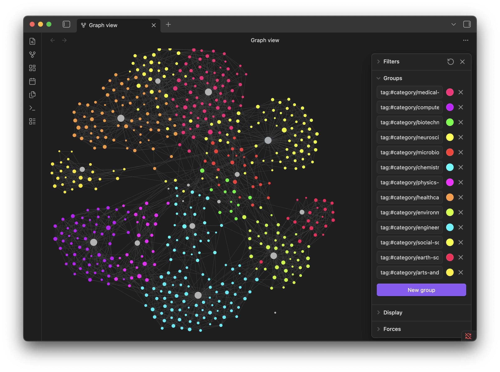

# UCSD Map of Science for Obsidian

An Obsidian vault generated from the 2010 UCSD Map of Science and Classification System.

The vault contains:

- 13 discipline notes
- 554 subdiscipline notes
- 13 visual category tags and Obsidian graph color groups
- Obsidian wikilinks for strongest source-map edges
- source coordinates, node sizes, discipline colors, and IDs in YAML frontmatter
- top source terms for each subdiscipline
- processed CSV files for downstream use

Open `vault/00 Index.md` in Obsidian.



## Graph Groups

The vault includes `.obsidian/graph.json` with 13 color groups. Groups are matched by `category/...` tags generated from the visual category/color table:

- Medical Sciences
- Computer Science & Engineering
- Biotechnology
- Neuroscience
- Microbiology & Immunology
- Chemistry
- Physics & Mathematics
- Healthcare & Nursing
- Environmental & Life Sciences
- Engineering & Materials Science
- Social Sciences & Economics
- Earth Sciences
- Arts & Humanities

## Repository Structure

```text
vault/
  00 Index.md
  Disciplines/
  Subdisciplines/
  Sources/
.obsidian/
  graph.json
docs/
  graph-preview.jpg
data/
  raw/
  processed/
scripts/
  build_vault.py
  validate_vault.py
```

## Rebuild

```bash
scripts/build_vault.py
scripts/validate_vault.py
```

The script reads `data/raw/UCSDmapDataTables.xlsx` and regenerates the vault plus processed CSV exports.

The graph color groups use tags derived from `data/raw/html_visual_categories.csv`, a minimal category/color extraction from the distributed HTML visualization.

## Source

Primary source:

Börner, Katy, Richard Klavans, Michael Patek, Angela Zoss, Joseph R. Biberstine, Robert Light, Vincent Larivière, and Kevin W. Boyack. 2012. "Design and Update of a Classification System: The UCSD Map of Science." PLoS ONE 7(7): e39464. https://doi.org/10.1371/journal.pone.0039464

Data page:

https://cns.iu.edu/2012-UCSDMap.html

Visual category/color source:

The `html_visual_categories.csv` file is a minimal extraction of visual category labels and colors from the Science Integrity Alliance interactive HTML visualization of the UCSD Map of Science. The full HTML artifact is not redistributed in this repository.

Required acknowledgment:

> The authors wish to acknowledge The Regents of the University of California, SciTech Strategies, Observatoire des Sciences et des Technologies, and the Cyberinfrastructure for Network Science Center for making the 2010 UCSD Map of Science and Classification System available for this work.

## License

The 2005 and 2010 UCSD Map of Science classification systems are distributed under Creative Commons Attribution-NonCommercial-ShareAlike 3.0 Unported.

This derivative Obsidian vault is distributed under the same license: CC BY-NC-SA 3.0.

Commercial use is not permitted under the source license.

## Scope

This is an unofficial derivative conversion for Obsidian. It is not affiliated with or endorsed by UC San Diego, SciTech Strategies, the Observatoire des Sciences et des Technologies, or the Cyberinfrastructure for Network Science Center.
